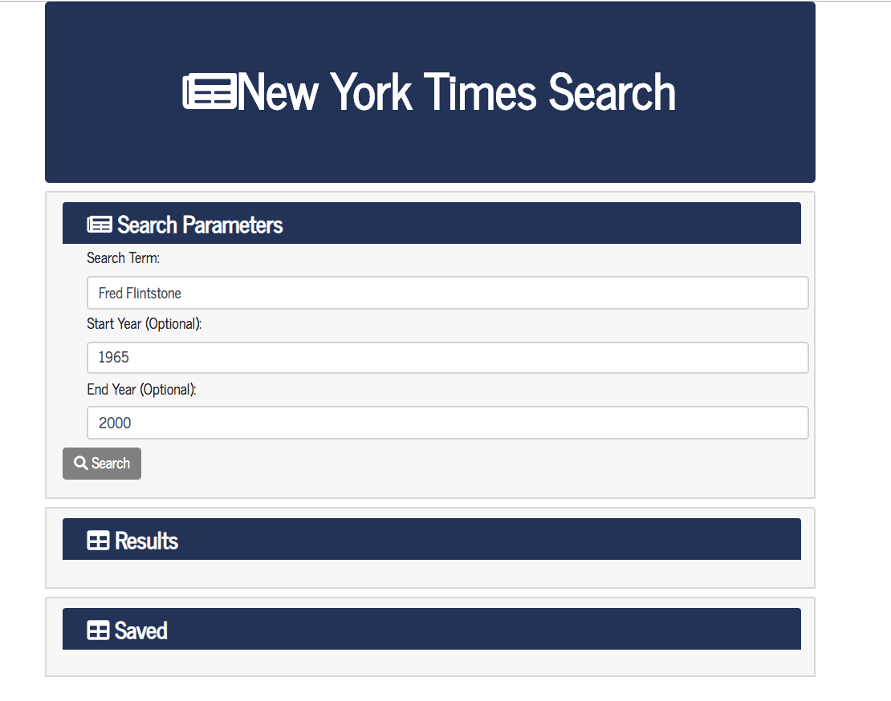
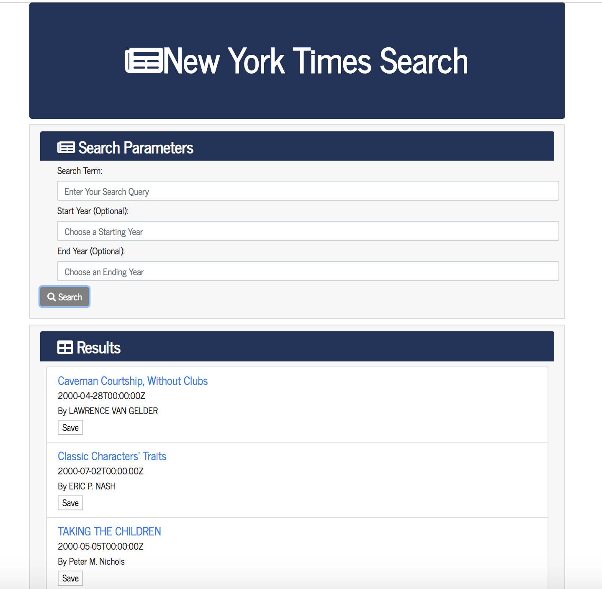
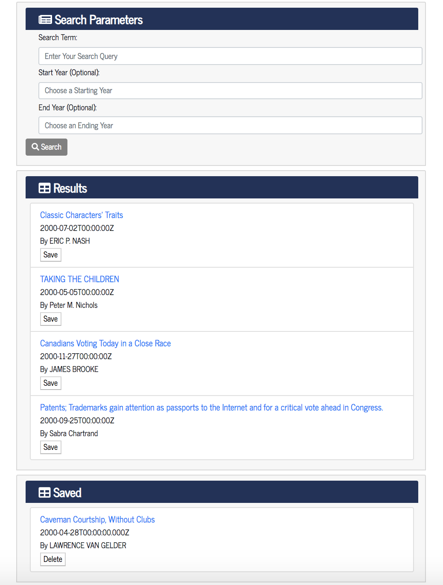

# New York Times Search - React Version

This application takes advantage of the New York Times article search API and provides a user-friendly interface to search this repository.

## Description 

This web application allows users to do article searches on the New York Times article database based on subject and optional date ranges.  It is implemented utilizing React technlogy to render the user interface as a single-page web application.  The application also allows for the users to save articles (utilizing through Express APIs access to MongoDB).

### Usage instructions

The user is presented with this front-page which will allow them to enter a search term and optional start/end dates.

Once the user enters their search parameters and submits, the application returns the top 5 results in the Results section of the page.  The articles returned have clickable links in the title which takes the user to the article itself in a new browser tab.  It also give the user a button where they can save the article.  The application will search through saved articles to avoid duplicate entries.

The Saved section of the page has all of the user's saved articles.  The user has to option to delete articles from this section through a delete button.

